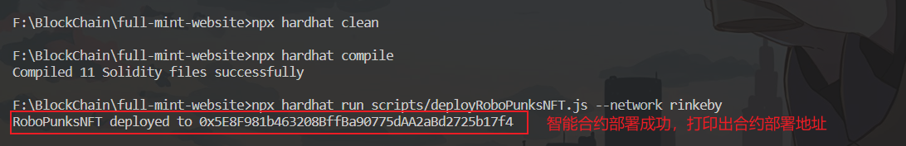
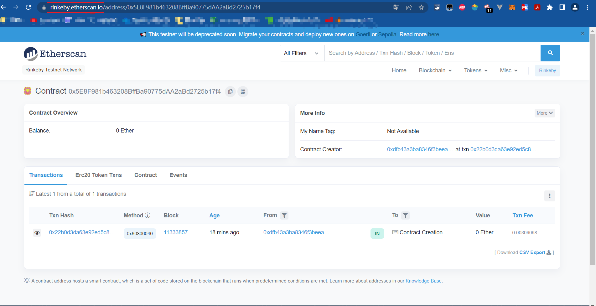

# NFT Mint网站搭建(Hardhat+React)

视频教程地址(两个教程是一样的，bilibili那个是搬运的youtube视频)：

youtube:https://www.youtube.com/watch?v=ynFNLBP2TPs

bilibili:https://www.bilibili.com/video/BV1G3411G7k5

项目实际运行图：(chakra-ui组件没有生效，不清楚为什么，有可能是chakra-ui package的版本原因)


教程里正确的样式应该是这样的：


1、环境：node v14.0.0; npm 6.14.4; 使用框架：hardhat-合约开发 + react-前端编写

2、合约代码位置：contracts/RoboPunksNFT.sol

3、部署脚本位置：scripts/deployRoboPunksNFT.js

4、配置文件：在项目根目录下添加名为“.env”的配置文件，文件内容(注意：下面的内容是不可用的，需要根据自己具体情况填写，下面只是示例；实际文件中需要将 //注释删除，这里注释只是为了说明每个配置项是什么)：

```javascript
REACT_APP_RINKEBY_RPC_URL='https://rinkeby.infura.io/v3/5affffff684aaaaab9xxxx609c9a2d'//在infura申请的rinkeby访问url
REACT_APP_ETHERSCAN_KEY='6VHaaaaRaaaaaTKHxxxxxxxxB2C4444448S'//在etherscan申请的API访问KEY
REACT_APP_PRIVATE_KEY='a862aaaaaaaaaae35482e44444447f4c8d8eaxxxxxxxxxx76b7ecggc456'//自己的钱包私钥
```

这些配置在项目根目录下的hardhat.config.js中被使用到

5、在项目根目录下执行以下命令，编译与部署合约：

```
npx hardhat clean
npx hardhat compile    --编译solidity合约代码
npx hardhat run scripts/deployRoboPunksNFT.js --network rinkeby    --部署合约，--network指定测试网络为rinkeby，网络相关配置在根目录下的hardhat.config.js中。(注意：这一步有可能需要科学上网)
```



在rinkeby测试网的etherscan上可以查看到部署的合约信息



(视频教程中还执行了命令：npx hardhat verify --network rinkeby 0x5E8F981b463208BffBa90775dAA2aBd2725b17f4 [这个参数是部署的合约地址]来验证合约，但是实际操作时会返回网络错误。应该不执行这个命令也没有什么问题，因为这个命令好像是为了验证合约代码，然后合约代码可以直接在etherscan上查看，这样的话，即使合约代码查看不了应该也没关系，只要不影响到合约执行就可以)

6、项目根目录下执行命令 "npm run start" 来运行项目

7、如果要铸币，需要先打开铸币功能，设置部署的合约上的 "isPublicMintEnabled" 参数 为true；但是这需要成功执行验证合约的命令 "npx hardhat verify --network rinkeby 合约地址" 后才能直接在etherscan上修改参数；如果无法成功执行验证合约的命令的话，可以考虑在合约代码里就把 isPublicMintEnabled 设置为 true，具体操作是在 RoboPunksNFT.sol 的构造函数 constructor() 中给变量 isPublicMintEnabled 赋值为 true，部署这一份新合约

8、由于字体资源是在线加载的谷歌的字体，因此需要科学上网，否则的话页面显示的字体样式可能与示例不一样